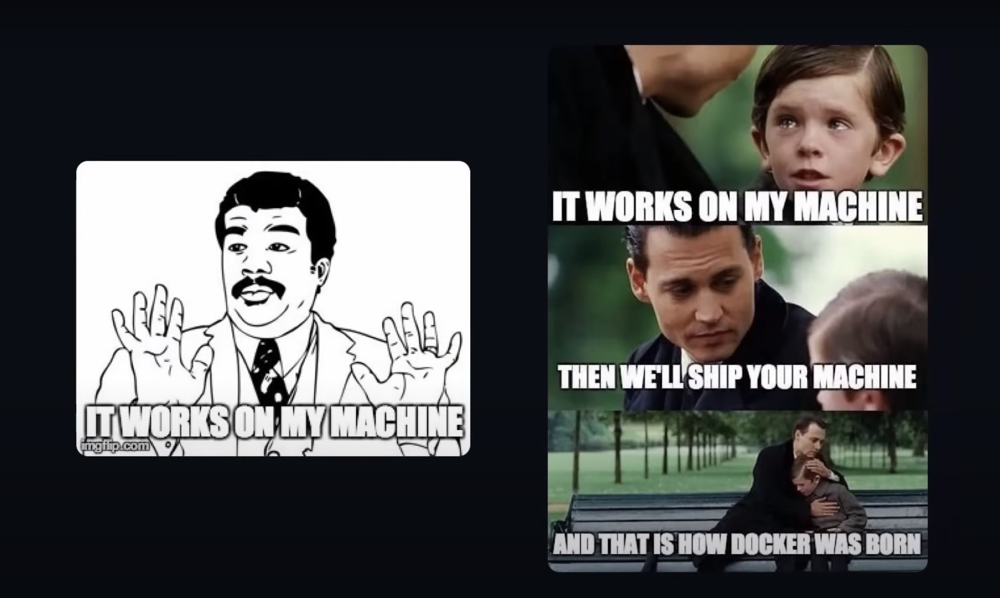

# Whale repository
My favorite Whale is Docker.  
After running this app you will **NEVER** say 
 
**"But it works on my machine?!😭"**

# Docker Hands-on Guide


Welcome to the Docker Hands-on Guide! This project aims to help programmers like me understand Docker and provide a hands-on approach to learning how to use Docker for deploying applications efficiently. Whether you're new to Docker or looking to expand your skills, this guide will walk you through the fundamentals and into more advanced concepts and practices.

## What is Docker?

Docker is a powerful tool for developers and system administrators to develop, ship, and run applications in containers. Containers allow you to package an application with all of its dependencies into a standardized unit for software development, ensuring that your application works seamlessly in any environment.

## Getting Started

Before diving into Docker, ensure your system meets the prerequisites and Docker is installed. Follow the official Docker documentation for detailed instructions on setting up Docker on [Mac](https://docs.docker.com/docker-for-mac/install/), [Linux](https://docs.docker.com/engine/install/), and [Windows](https://docs.docker.com/docker-for-windows/install/).

To verify your Docker installation, run the following command:
```bash
docker run hello-world
```
if that doesn't work run:
```bash
docker --version
```

This command downloads a test image and runs it in a container. If everything is set up correctly, you'll see a message indicating that your Docker installation is working correctly.

## Tutorial Overview

This hands-on guide will cover various aspects of Docker, including:

- **Docker Basics:** Understanding what Docker is, how it works, and the key concepts of containers and images.
- **Dockerfile:** Learn how to create a `Dockerfile` to automate the building of Docker images.
- **Docker Compose:** Simplify the management of multi-container applications with Docker Compose.
- **Deploying Applications:** Get hands-on experience deploying a simple web application using Docker.
- **Sharing Containers:** Learn how to share your Docker containers with colleagues or the Docker community using Docker Hub.

Each section contains step-by-step instructions and examples to help you get hands-on experience with Docker.

# Docker Hub Integration

Docker Hub is the world's largest library and community for container images, offering an extensive array of content from open source projects, individual developers, and software vendors. Utilizing Docker Hub, developers can easily find, share, and deploy container images to streamline application development and deployment processes.

## Key Features of Docker Hub

- **Repository Management:** Docker Hub allows users to push and pull container images from public and private repositories, facilitating easy sharing and collaboration.
- **Automated Builds:** Link your GitHub or Bitbucket repositories to Docker Hub for automatic image builds upon code changes, ensuring your Docker images are always up to date.
- **Webhooks:** Automate workflows by configuring webhooks to trigger actions after successful pushes to repositories, enabling seamless integration with other services.
- **Docker Hub CLI and API:** For advanced users, Docker Hub provides a Command Line Interface (CLI) tool (currently experimental) and a comprehensive API to automate tasks and integrate with Docker Hub programmatically.

## Getting Started with Docker Hub

1. **Create a Docker ID:** Sign up for a free Docker account [here](https://hub.docker.com/signup) to start using Docker Hub.
2. **Create a Repository:** Once signed in, [create a repository](https://docs.docker.com/docker-hub/repos/) on Docker Hub to store your Docker images.
3. **Automate Builds:** Link your code repositories to enable [automated builds](https://docs.docker.com/docker-hub/builds/), ensuring your images are always updated with the latest code changes.
4. **Explore and Pull Images:** Browse through thousands of [public repositories](https://hub.docker.com/search?type=image) on Docker Hub and pull images using the Docker CLI syntax:
```bash
docker pull <repository>/<image>:<tag>
```
5. **Push Your Own Images:** Build your Docker image and push it to your Docker Hub repository to share with the world:


For detailed documentation and additional features, visit the [Docker Hub documentation](https://docs.docker.com/docker-hub/).

## Docker Hub API

Developers looking to integrate more deeply with Docker Hub can explore the [Docker Hub API documentation](https://docs.docker.com/docker-hub/api/latest/) for information on supported endpoints and operations.

## Additional Resources

- [Docker Official Documentation](https://docs.docker.com/)
- [Docker Hub Quickstart](https://docs.docker.com/docker-hub/quickstart/)
- [Managing Billing and Subscriptions](https://docs.docker.com/docker-hub/billing/)

Docker Hub provides a central hub for managing Docker images, automating builds, and collaborating with teams and the Docker community, making it an essential tool for modern containerized applications.

## Hands-on Exercises

This guide includes hands-on exercises to help solidify your understanding of Docker. You'll start by building a simple web application container and progressively move on to more complex scenarios, including multi-container applications.

## Additional Resources

To deepen your knowledge of Docker, consider exploring the following resources:

- [Docker Official Documentation](https://docs.docker.com/)
- [Docker Curriculum](https://docker-curriculum.com/)
- [Play with Docker Classroom](https://training.play-with-docker.com/)

## Feedback

Your feedback is important to us! If you have suggestions on how to improve this guide or encounter any issues, please feel free to contribute to the project or open an issue on GitHub.

Happy Dockerizing!

